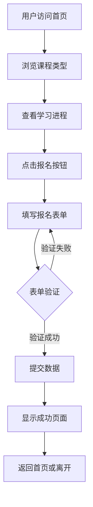

# NexaLearn AI Academy 网站产品需求文档

## 1. 产品概述

NexaLearn AI Academy 是一个在线AI课程报名平台，旨在帮助用户学习如何将AI真正应用于日常工作和学习场景。目标用户为学生、职场人士和对AI应用感兴趣的人群。平台提供清晰的课程介绍、学习进程展示和便捷的报名流程。

## 2. 核心功能

### 2.1 用户角色

| 角色 | 注册方式 | 核心权限 |
|------|----------|----------|
| 访客 | 无需注册 | 浏览课程信息、填写报名表单 |

### 2.2 功能模块

1. **首页**: 主视觉展示、导航栏、课程亮点介绍
2. **课程类型页**: 四种AI实战课程展示卡片
3. **学习进程页**: 时间线展示课程安排
4. **报名表单页**: 用户信息收集表单
5. **报名成功页**: 提交成功反馈页面

### 2.3 页面详情

| 页面名称 | 模块名称 | 功能描述 |
|----------|----------|----------|
| 首页 | Hero区域 | 背景图片展示、主标题、副标题、立即报名按钮 |
| 首页 | 导航栏 | 响应式导航、桌面端导航链接、移动端汉堡菜单 |
| 课程类型页 | 课程卡片 | 四种课程类型展示（办公效率、内容营销、产品原型、Agent工作流） |
| 课程类型页 | 课程交互 | 卡片hover效果、边框高亮 |
| 学习进程页 | 时间线 | 公开课 + 4周课程安排，带日期标签 |
| 学习进程页 | 进程卡片 | 每周课程详情展示 |
| 报名表单页 | 表单字段 | 姓名、手机号、邮箱、学校、专业 |
| 报名表单页 | 表单验证 | 必填字段验证、格式校验 |
| 报名表单页 | 数据提交 | 表单数据收集与存储 |
| 报名成功页 | 成功反馈 | 绿色勾选图标、成功文案、返回首页按钮 |

## 3. 核心流程

用户访问网站 → 浏览课程信息 → 了解学习进程 → 点击报名 → 填写表单 → 提交成功 → 收到确认反馈

## 4. 用户界面设计

### 4.1 设计风格

- **主色调**: 黑色背景 (#000000) + 绿色强调色 (#95ff8d)
- **按钮风格**: 圆角按钮，带发光效果
- **字体**: Righteous (标题) + Roboto Flex (正文)
- **布局风格**: 单页滚动式布局，顶部固定导航
- **图标风格**: Lucide图标库，绿色描边

### 4.2 页面设计概览

| 页面名称 | 模块名称 | UI元素 |
|----------|----------|--------|
| 首页 | Hero区域 | 全屏背景图、居中标题、发光CTA按钮 |
| 首页 | 导航栏 | 深色背景、绿色Logo、响应式汉堡菜单 |
| 课程类型页 | 课程卡片 | 2x2网格布局、hover边框高亮、图标+标题+描述 |
| 学习进程页 | 时间线 | 垂直时间线、绿色圆点、卡片式内容 |
| 报名表单页 | 表单卡片 | 深色卡片背景、输入框focus高亮、发光提交按钮 |
| 报名成功页 | 成功图标 | SVG勾选图标、发光效果、居中布局 |

### 4.3 响应式设计

- **桌面端优先**: 1440px基准设计
- **移动端适配**: 768px以下切换为单列布局、汉堡菜单
- **触摸优化**: 按钮尺寸适配触摸操作、表单输入优化

### 4.4 交互效果

- 导航栏滚动高亮当前section
- 课程卡片hover边框发光
- 表单输入focus状态高亮
- 提交按钮hover发光增强
- 成功页面图标发光动画