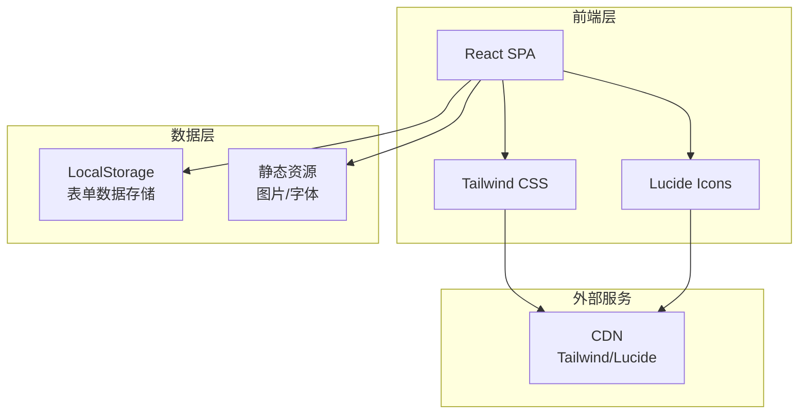

# NexaLearn AI Academy 技术架构文档

## 1. 架构设计



## 2. 技术说明

- **前端框架**: React 18 + Vite
- **样式方案**: Tailwind CSS v4 (CDN运行时)
- **图标库**: Lucide Icons
- **字体**: Google Fonts (Righteous, Roboto Flex)
- **数据存储**: LocalStorage (表单数据本地存储)
- **构建工具**: Vite

## 3. 路由定义

| 路由 | 目的 |
|------|------|
| `/` | 首页（主视觉） |
| `/courses` | 课程类型展示 |
| `/schedule` | 学习进程时间线 |
| `/signup` | 报名表单页 |
| `/success` | 报名成功页 |

## 4. 组件结构

```
src/
├── components/
│   ├── Header.jsx          # 响应式导航栏
│   ├── Hero.jsx            # 主视觉区域
│   ├── CourseCard.jsx      # 课程类型卡片
│   ├── Timeline.jsx        # 学习进程时间线
│   ├── SignupForm.jsx      # 报名表单
│   ├── SuccessPage.jsx     # 成功页面
│   └── Footer.jsx          # 页脚
├── pages/
│   └── App.jsx             # 主应用（单页路由）
├── hooks/
│   └ useForm.js           # 表单处理Hook
│   └ useLocalStorage.js   # 本地存储Hook
├── styles/
│   └ globals.css          # 全局样式变量
└── main.jsx                # 入口文件
```

## 5. 数据模型

### 5.1 报名表单数据结构

```typescript
interface SignupData {
  name: string;       // 姓名
  phone: string;      // 手机号
  email: string;      // 邮箱
  school: string;     // 学校
  major: string;      // 专业
  submittedAt: string; // 提交时间戳
}
```

### 5.2 LocalStorage存储方案

- **存储键**: `nexalearn_signups`
- **数据格式**: JSON数组
- **示例数据**:
```json
[
  {
    "name": "张三",
    "phone": "13800138000",
    "email": "zhangsan@example.com",
    "school": "北京大学",
    "major": "计算机科学",
    "submittedAt": "2025-06-23T10:30:00Z"
  }
]
```

## 6. 表单验证规则

| 字段 | 验证规则 |
|------|----------|
| 姓名 | 必填，长度2-20字符 |
| 手机号 | 必填，11位数字，符合中国手机号格式 |
| 邮箱 | 必填，符合邮箱格式 |
| 学校 | 必填，长度2-50字符 |
| 专业 | 必填，长度2-50字符 |

## 7. 性能优化

- Tailwind CSS CDN运行时（无需构建）
- Lucide Icons按需加载
- 图片懒加载
- 组件懒加载（React.lazy）
- LocalStorage异步写入

## 8. 部署方案

- **静态部署**: Vercel / Netlify / GitHub Pages
- **构建命令**: `npm run build`
- **输出目录**: `dist/`
- **环境要求**: Node.js 18+